# Home Assistant Beszel Agent Integration

Bring your [Beszel](https://beszel.dev/) monitored servers into Home Assistant — as devices, sensors, and ready-made dashboard cards.

> **Unofficial project.** Not affiliated with the Beszel project. All monitoring is done by [Beszel](https://github.com/henrygd/beszel) by [henrygd](https://github.com/henrygd) — see [Credits](#credits).

> **Background:** this project is an evolution of [home-assistant-glances-card](https://github.com/filipeamorimdev/home-assistant-glances-card). I migrated my infrastructure monitoring from Glances to Beszel, and this is the Home Assistant side of that move.

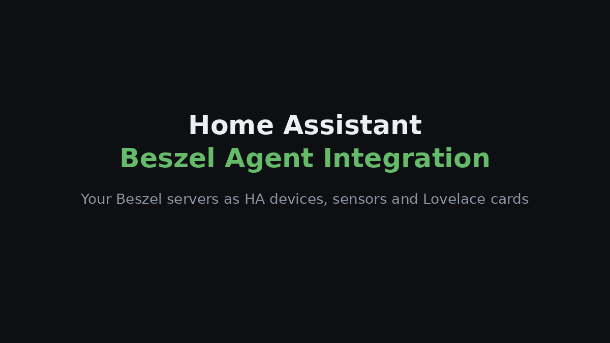

## Features

- **One device per Beszel system**, with sensors for status, CPU, memory, disk, temperature, network, uptime and load. GPU, battery, systemd health and agent version appear when Beszel reports them.
- **Live updates** from your Hub, with new systems appearing without a restart.
- **Two dashboard cards** bundled with the integration — a machine card and a systems table — with visual editors and automatic sensor selection.
- **Compact, detailed, table, grid and terminal layouts**, theme-aware, with health colours and readable network speeds.
- **Offline-aware:** offline machines show as down instead of publishing stale numbers.
- **Safe sign-in:** a normal, readonly Beszel account is enough; your password is used once and never stored.

## Requirements

This integration only *reads* from Beszel. You need to set up Beszel first:

1. A **Beszel Hub** that Home Assistant can reach ([getting started](https://beszel.dev/guide/getting-started)).
2. The **Beszel agent installed on every machine** you want to monitor, each added to the Hub ([agent installation](https://beszel.dev/guide/agent-installation)). Machines without an agent will not show up.
3. A **Beszel user** (readonly is enough) that can see those systems.
4. **Home Assistant 2026.6 or newer.**

Once a machine shows as **Up** in the Beszel web UI, it will appear in Home Assistant.

## Installation

Manual custom-component install (HACS is not supported for now):

1. Download the latest zip from [Releases](../../releases) (or use **Code → Download ZIP** / `git clone`).
2. Copy `custom_components/beszel_machine_card` into your Home Assistant `config/custom_components/` folder.
3. Restart Home Assistant.
4. Go to **Settings → Devices & services → Add integration** and search for **Home Assistant Beszel Agent Integration**.

The cards are loaded by the integration itself — no Lovelace resource to add. To update, replace the folder, restart, and hard-refresh your browser.

## Connect your Hub

Enter the Hub address Home Assistant can reach, then sign in with your Beszel account.

| Hub URL | Account |
| --- | --- |
| 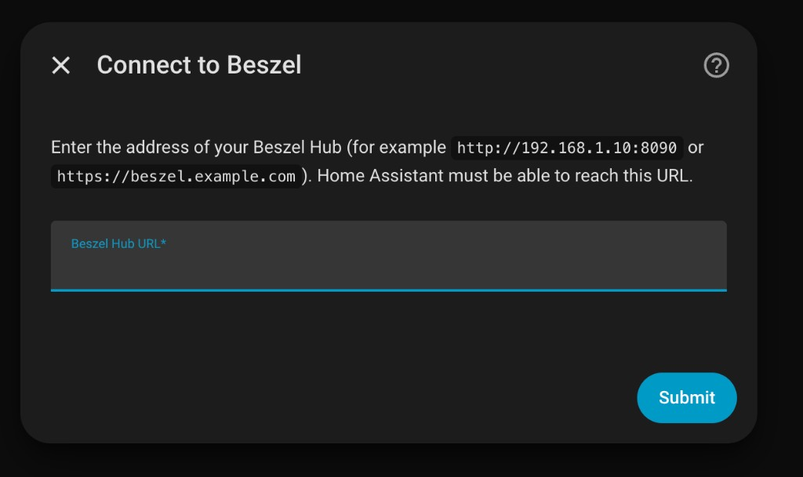 | 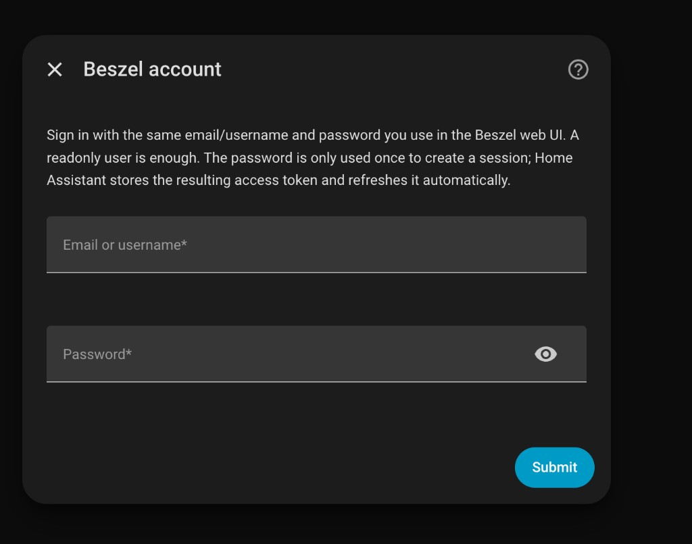 |

- Use a normal Beszel user (not a PocketBase `_superusers` account). A readonly user with access to the systems you need is enough.
- HTTPS is recommended if the Hub is reachable beyond your LAN.
- If the session can't be refreshed, Home Assistant will ask you to sign in again.

## Cards

Both cards appear in the Lovelace card picker under **Add card**.

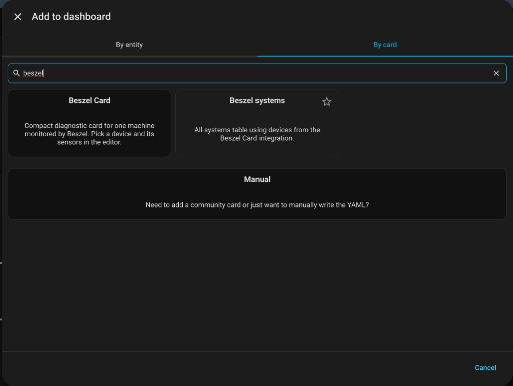

### Machine card

One server, as compact tiles or as a detailed list. Pick a device and everything else is filled in.

| Compact tiles | Detailed list |
| --- | --- |
| 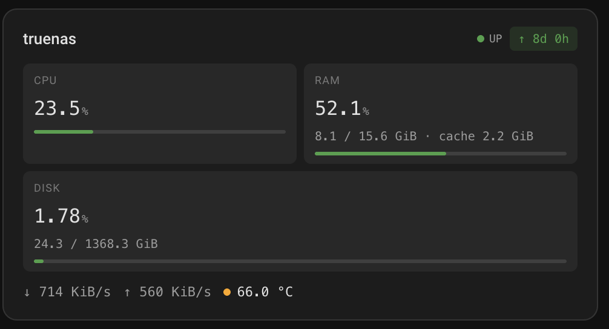 | 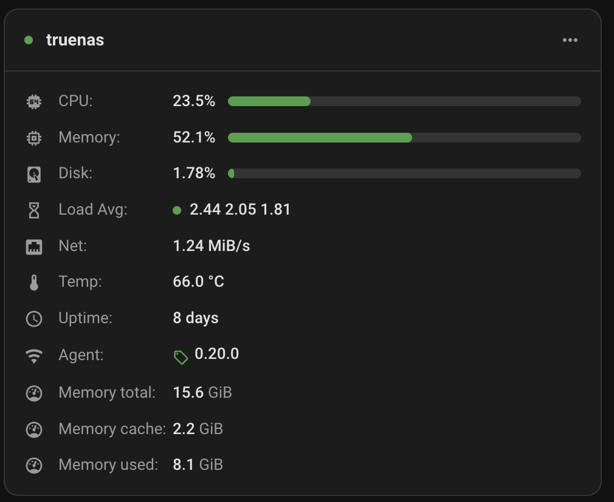 |

- **Compact** (default): CPU, RAM and Disk tiles with meters, used / total sizes, network speed, temperature and uptime.
- **Detailed:** the rows of a Beszel system card — CPU, Memory, Disk, Load Avg, Net, Temp, Services, Uptime, Agent — plus any extra metrics you add.
- Meters change colour at the warning / critical thresholds (65% / 90% by default).

```yaml
type: custom:beszel-machine-card
device_id: 0123456789abcdef0123456789abcdef
title: TrueNAS
layout: detailed          # or compact (default)
```

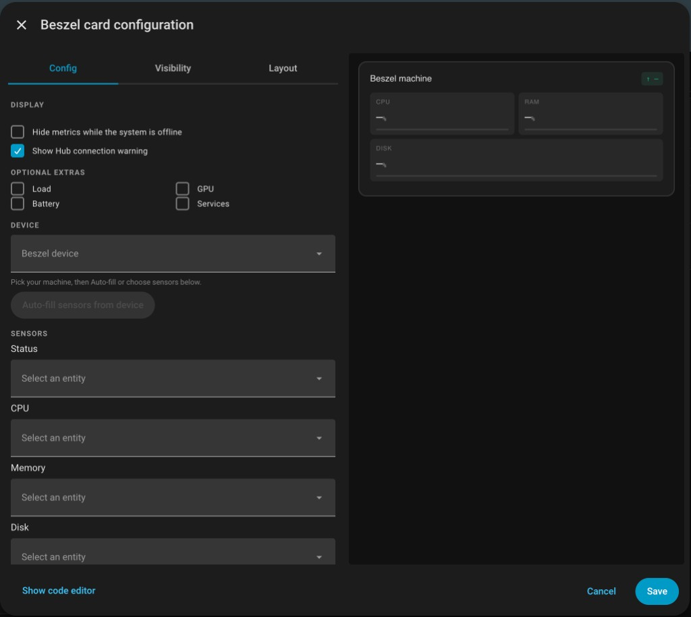

### Systems table

Beszel's "All Systems" view for every machine: a sortable table, or a grid of cards that takes over on narrow screens.

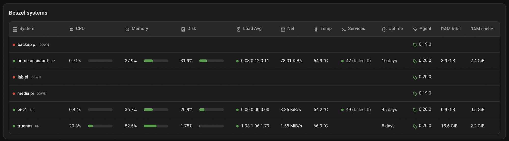

Choose only the columns you need for a smaller overview:

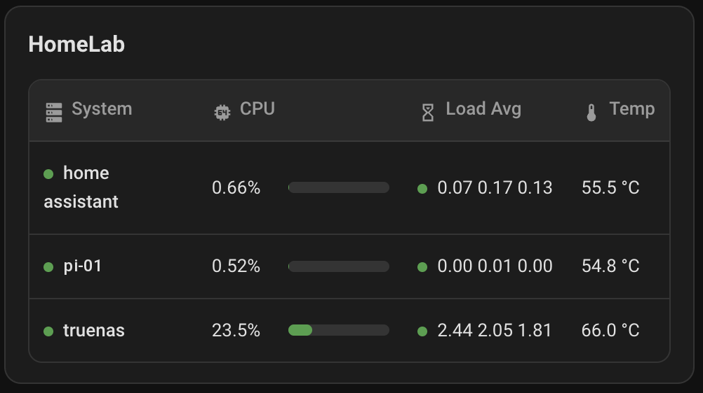

Or use the grid layout, which suits phones and narrow columns:

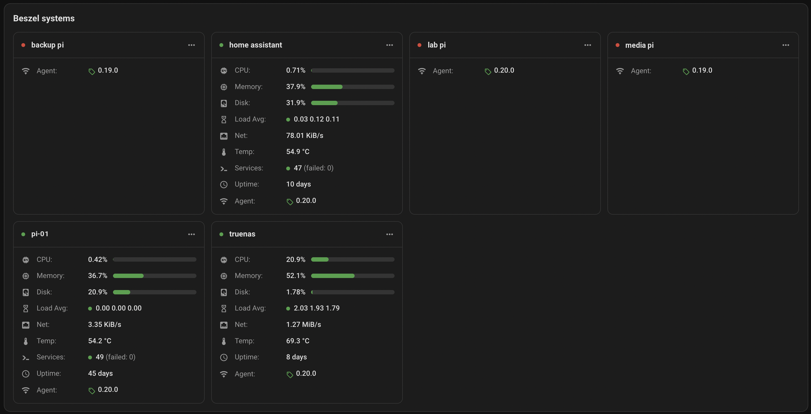

- Click a header to sort; click a row to open the device page.
- Offline machines stay in the list with blank metrics, so a machine that stops reporting is obvious. **Hide offline systems** removes them.
- Columns that no machine reports are hidden automatically.

```yaml
type: custom:beszel-systems-table-card
title: Homelab
layout: auto              # table | grid | auto
columns: [cpu, load, temperature]
hide_when_offline: true
```

### Terminal style

Enable **Terminal style** in either card editor (`style: terminal`) for a green monospace look. It also renders on very old browsers.

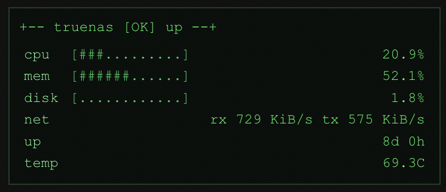

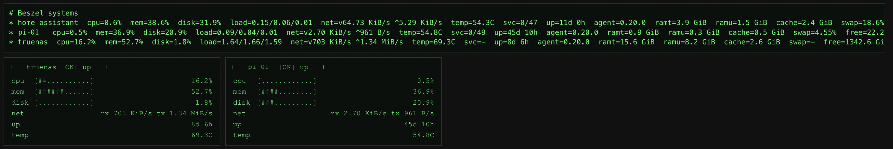

For old tablets where custom cards don't run at all (Android 4), paste the bundled [native terminal card](custom_components/beszel_machine_card/frontend/beszel-native-terminal.yaml) into a **Manual** card instead.

## Sensors

Every system becomes a device with core sensors (status, CPU, memory, disk, temperature, network, uptime, load). Extra detail — RAM and disk totals, swap, fan speed and more — appears when Beszel reports it. Very detailed sensors (per-core CPU, per-interface network, per-GPU, machine identity) are disabled by default; enable them from the device page if you want them.

Containers, SMART devices, individual systemd services and ZFS datasets are not imported.

## Credits

This project builds on **[Beszel](https://github.com/henrygd/beszel)** by [henrygd](https://github.com/henrygd) and its contributors (MIT). The Beszel agent collects the data and the Hub stores it; this integration only displays it in Home Assistant. Docs: <https://beszel.dev/>. If you find this useful, consider starring Beszel too.

## License

MIT
